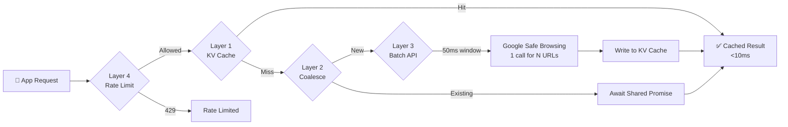

# Seycure

Privacy-first mobile security toolkit to **analyze suspicious links**, **strip metadata from media/documents**, and **auto-blur sensitive text in screenshots** — designed to run *mostly on-device*.

> Project by **ArkQube**.

<!-- Optional: add a logo/banner here -->
<!--  -->

## Status

> **Active development.** APIs, UI, and scoring heuristics may change.

## Highlights

- **Link Shield**: unwraps shortened URLs, removes trackers, classifies links, and computes a multi-signal trust score.
- **Media Scrubber**: reads and removes metadata from **images**, **PDFs**, and **DOCX** locally.
- **Privacy Blur**: on-device OCR + rules/learning to detect and blur sensitive text in screenshots.

## Demo / Screenshots

- **Demo video:** *(coming soon)*
- **Screenshots:** *(coming soon)*

> If you add images later, a common pattern is:
>
> ```md
> 
> 
> 
> ```

## Table of Contents

- [Motivation](#motivation)
- [Core Features](#core-features)
  - [Link Shield](#1-link-shield)
  - [Media Scrubber](#2-media-scrubber)
  - [Privacy Blur](#3-privacy-blur)
- [Architecture & Tech Stack](#architecture--tech-stack)
- [Project Structure](#project-structure)
- [Setup & Development](#setup--development)
- [Privacy & Permissions](#privacy--permissions)
- [Technical Deep Dive (optional)](#technical-deep-dive-optional)
- [Changelog](#changelog)
- [License](#license)

---

## Motivation

In today’s digital landscape, users frequently share links and media without knowing the hidden risks:

1. **Shortened URLs** (e.g., bit.ly) obscure the true destination of a link, often masking phishing attempts or malware downloads.
2. **Media files** (photos/videos) can contain EXIF metadata (GPS coordinates, device model, software versions).
3. **Documents** (PDF/DOCX) can embed author/company metadata.
4. **Screenshots** may contain sensitive information (emails, phone numbers, IDs, addresses) that users unknowingly share.

Seycure addresses these with three modes:

| Mode | Purpose |
|------|---------|
| **Link Shield** | Sandboxed environment to unwrap, classify, score, and safely preview URLs |
| **Media Scrubber** | Local tool that reads, displays, and strips metadata from images, PDFs, and DOCX files |
| **Privacy Blur** | OCR-based scanner that detects and auto-blurs sensitive text in screenshots |

---

## Core Features

### 1. Link Shield

The Link Shield acts as a secure quarantine zone for URLs. It combines multiple analysis layers to give users a clear picture of a link’s safety **before** they open it.

**URL input methods**
- Paste a URL
- Scan a QR code (camera) via `html5-qrcode` (includes **hardware camera zoom** slider via WebRTC)
- Select a QR image from gallery (decoded locally)

**What it does**
- Removes tracking parameters (UTM + many common trackers)
- Detects & resolves shortened URLs
- Assesses file-extension risk (e.g., `.apk`, `.exe`, `.zip`)
- Classifies links into categories (e.g., Gambling, Adult, Education, Government)
- Computes a multi-signal **trust score**
- Optional Google Safe Browsing check via Cloudflare Worker proxy
- Safe preview using a sandboxed `iframe`

### 2. Media Scrubber

Strips metadata locally from:
- **Images** (EXIF)
- **PDFs** (Author/Title/Producer/etc.)
- **DOCX** (docProps metadata)

Also supports anonymous export + renaming (e.g. `ArkQube_[timestamp]_[random-hash].[ext]`) and sharing via native Android share sheet.

### 3. Privacy Blur

On-device OCR (Google ML Kit) + rule-based detection that:
- Detects sensitive text patterns (IDs, phones, emails, bank details, etc.)
- Applies automatic blur
- Includes a manual blur editor
- Learns from user corrections over time (always-blur / never-blur + app layout memory)

---

## Architecture & Tech Stack

Seycure uses a hybrid web-to-native architecture combining **React** with Android via **Capacitor**. The app is **offline-first** and aims to keep processing on-device.

### System Data Flow

```mermaid
flowchart TD
    App["📱 Seycure App<br/>React / Vite / Capacitor"]

    subgraph LinkShield ["🔗 Link Shield"]
        InputURL{"URL Input"}
        Clean["Tracker Removal<br/>30+ params stripped"]
        Classify["Hybrid Classifier<br/>13 categories, 4 signals"]
        TrustScore["Trust Scorer<br/>15 signals, earn-based"]
        LocalCheck["Local Heuristics<br/>IPs, TLDs, Phishing"]
        RDAP["rdap.org API<br/>Domain Age & Identity"]
        CORS["allorigins.win<br/>Redirect Tracer"]
        CFWorker["Cloudflare Worker<br/>Edge Proxy"]
        GSB[("Google Safe<br/>Browsing DB")]

        InputURL --> Clean --> Classify --> TrustScore
        TrustScore --> LocalCheck
        TrustScore --> RDAP
        Clean --> CORS
        LocalCheck -->|"Optional Deep Scan"| CFWorker
        CFWorker -->|"Hashed Threat Check"| GSB
    end

    subgraph MediaScrubber ["🖼️ Media Scrubber"]
        InputMedia{"Image / PDF / DOCX"}
        ExifParse["exifr / pdf-lib / jszip<br/>Extract Metadata"]
        CanvasApp["Canvas Redraw / XML Strip<br/>Destroy Metadata"]
        FileSystem["Capacitor FileSystem<br/>Anonymous Export"]

        InputMedia --> ExifParse --> CanvasApp --> FileSystem
    end

    subgraph PrivacyBlur ["🔍 Privacy Blur"]
        InputScreenshot{"Screenshot Upload"}
        OCR["ML-Kit OCR<br/>On-Device Text Recognition"]
        PatternMatch["Pattern Detector<br/>Email, Phone, IDs"]
        BlurEngine["Gaussian Blur Engine<br/>Canvas-based"]
        Export["Share / Save"]

        InputScreenshot --> OCR --> PatternMatch --> BlurEngine --> Export
    end

    App --> LinkShield
    App --> MediaScrubber
    App --> PrivacyBlur
```



### Frontend

| Technology | Purpose |
|-----------|---------|
| React 18 + TypeScript | UI framework + type safety |
| Vite 7 | Bundler / dev server |
| Shadcn UI + Vanilla CSS | UI components + styling |
| Lucide React | Icons |
| `exifr` | EXIF parsing |
| `html5-qrcode` | QR scanning |
| `pdf-lib` | PDF metadata read/write |
| `jszip` | DOCX parsing/modification |

### Native Bridge (Android)

| Technology | Purpose |
|-----------|---------|
| Capacitor v6 | Web-to-native bridge |
| `@capacitor/share` | Native share sheet |
| `@capacitor/filesystem` | Device storage |
| `@capacitor/app` | App lifecycle |
| `@capacitor/preferences` | Persistent local storage |
| Google ML Kit | On-device OCR |

### Backend (Optional)

| Technology | Purpose |
|-----------|---------|
| Cloudflare Workers | Edge proxy |
| Google Safe Browsing API | Threat database lookup |

> Note: The core app logic (RDAP checks, metadata scrubbing, classification, trust scoring, OCR) is designed to run on-device. The Worker is only needed for Google Safe Browsing API access.

---

## Project Structure

```text
.
├── app/                              # Main frontend + native bridge
│   ├── android/                      # Native Android project (Capacitor-generated)
│   ├── public/                       # Static assets (logo, icons)
│   ├── src/
│   │   ├── components/
│   │   ├── hooks/
│   │   ├── lib/
│   │   ├── App.tsx
│   │   └── index.css
│   ├── capacitor.config.ts
│   ├── package.json
│   └── vite.config.ts
│
├── worker/                           # Cloudflare Worker proxy (optional)
│   ├── src/
│   │   └── index.ts
│   ├── package.json
│   ├── tsconfig.json
│   └── wrangler.toml
│
└── README.md
```

---

## Setup & Development

### 1. Prerequisites
- Node.js v18+
- Android Studio (Ladybug+ recommended)
- Java JDK v17+
- (Optional) Cloudflare Wrangler CLI: `npm i -g wrangler`

### 2. Run the web app locally

```bash
cd app
npm install --legacy-peer-deps
npm run dev
```

### 3. Build & run on Android

```bash
cd app
npm run build
npx cap sync android
```

Then open `app/android` in Android Studio and run on an emulator/device.

### 4. (Optional) Cloudflare Worker proxy

```bash
cd worker
npm install

npx wrangler kv:namespace create GSB_CACHE
npx wrangler deploy
npx wrangler secret put GOOGLE_SAFE_BROWSING_API_KEY
```

Worker endpoints:

| Endpoint | Method | Description |
|----------|--------|-------------|
| `/check?url=<target>` | GET | Full check (cache → coalesce → batch → rate limit) |
| `/redirects?url=<target>` | GET | Redirect chain tracer (up to 10 hops) |
| `/stats` | GET | Health check + metrics |
| `/` | POST | Legacy raw Safe Browsing proxy |

---

## Privacy & Permissions

Seycure processes everything on-device wherever possible.

| Permission | When Requested | Why Required |
|-----------|---------------|-------------|
| `CAMERA` | QR Code Scanner | Camera access for scanning |
| `READ_MEDIA_IMAGES` | Media Scrubber / Privacy Blur | Select images for scrubbing or OCR |
| `READ_EXTERNAL_STORAGE` | Legacy Android support | File access on Android < 13 |

Network requests made:
- `allorigins.win` — resolving shortened URLs and fetching page titles
- `rdap.org` — public domain WHOIS/RDAP data
- Cloudflare Worker — Google Safe Browsing queries only (optional)

> No user media, browsing history, or personal data is uploaded or stored off-device.

---

## Technical Deep Dive (optional)

<details>
<summary><b>Link classification: 4-signal hybrid model + categories</b></summary>

A zero-latency classifier that categorizes URLs using priority-ordered signals:

```text
Signal 1: TLD pattern → confident? → return category
Signal 2: Domain keywords → match? → return category
Signal 3: Page title keywords → match? → return category
Signal 4: Known domain list → found? → return category
Result: Unknown
```

</details>

<details>
<summary><b>Trust score: earn-based multi-signal scoring</b></summary>

The trust score starts at 0 and earns/loses points from multiple signals (domain age, HTTPS, entropy, redirect detection, suspicious TLDs, etc.).

</details>

<details>
<summary><b>Worker scaling architecture (KV cache + coalescing + batching + rate limits)</b></summary>



</details>

---

## Changelog

### v2.4 — Comprehensive Detection & UI Polish
- Massive update to Privacy Blur detection engine (15+ new patterns)
- Strict-by-default blurring policy (10+ digit numbers blur unless strongly identified as safe references)
- Swipe navigation gestures between the 3 main tabs
- QR Code Scanner hardware camera zoom slider via WebRTC

### v2.3 — On-Device Privacy Learning
- 4-priority learning pipeline in OCR (user rules → app memory → built-in patterns)
- Learned rules settings UI + spatial memory

### v2.2 — Worker Scaling Architecture
- KV cache + in-memory coalescing + batch API calls + per-IP rate limiting

### v2.1 — Trust Score Overhaul & Link Classification
- Earn-based trust score + hybrid link classifier + warning modal

### v2.0 — Three-Mode Navigation
- Privacy Blur mode + manual blur editor
- PDF/DOCX metadata clearing

### v1.0 — Initial Release
- Link Shield + Media Scrubber + QR code scanning

---

## License

**Proprietary / All Rights Reserved.**

Copyright (c) ArkQube.

You may not copy, modify, distribute, or use this software without explicit permission from the author.
