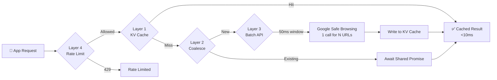

# 🛡️ Seycure by ArkQube

Seycure is a modern, privacy-first mobile application designed to protect users from digital threats: **malicious links**, **hidden metadata in media files**, and **sensitive content in screenshots**. Built with complete on-device processing, Seycure ensures your data never leaves your device without your explicit intent.

---

## 🎯 Motivation & Problem Statement

In today's digital landscape, users frequently share links and media without knowing the hidden risks:

1. **Shortened URLs** (e.g., bit.ly) obscure the true destination of a link, often masking phishing attempts or malware downloads.
2. **Media Files** (photos and videos) contain invisible EXIF metadata (exact GPS coordinates, device models, software versions) that can compromise physical privacy.
3. **Document Files** (PDFs and DOCX) embed author names, company info, and other identifying metadata that leaks personal information.
4. **Screenshots** may contain sensitive information (emails, phone numbers, addresses) that users unknowingly share.

**Seycure solves these issues by providing a three-mode utility:**

| Mode | Purpose |
|------|---------|
| **Link Shield** | Sandboxed environment to unwrap, classify, score, and safely preview URLs |
| **Media Scrubber** | Local tool that reads, displays, and strips all metadata from images, PDFs, and DOCX files |
| **Privacy Blur** | ML-powered OCR scanner that detects and auto-blurs sensitive text in screenshots |

---

## 🌟 Core Features in Detail

### 1. 🔗 Link Shield — Threat Detection, Classification & Trust Scoring

The Link Shield acts as a secure quarantine zone for URLs. It combines multiple analysis layers to give users a complete picture of a link's safety before they click.

#### URL Input Methods
- **Paste URL** — Paste any URL into the input field
- **QR Code Scanner** — Scan QR codes using the device camera via `html5-qrcode`
- **From Gallery** — Select an image containing a QR code; the app decodes it locally

#### Layer 1: URL Cleaning & Tracker Removal
- Automatically detects and strips **30+ known tracking parameters** (UTM, Facebook, Adobe, HubSpot, Mailchimp, etc.)
- Shows a before/after comparison of tracker count removed
- Preserves functional query parameters while removing surveillance

#### Layer 2: URL Shortener Detection & Resolution
- Maintains a local blocklist of **18 URL shortener domains** (bit.ly, t.co, tinyurl.com, etc.)
- Resolves shortened URLs through the `allorigins.win` CORS proxy without executing JavaScript
- Displays the final resolved destination to the user

#### Layer 3: File Risk Assessment
- Analyzes the URL's file extension against a risk database
- Risk levels: `critical` (.exe, .bat, .scr), `high` (.apk, .dmg, .jar), `medium` (.zip, .iso, .docm), `low` (.pdf, .doc)
- Displays colored risk banners with warnings

#### Layer 4: Hybrid Link Classification (13 Categories)

A zero-latency classifier that categorizes URLs using **4 priority-ordered signals**:

```
Signal 1: TLD pattern → confident? → return category (e.g., .edu → Education)
    ↓ not confident
Signal 2: Domain keywords → match? → return category (e.g., "casino" → Gambling)
    ↓ no match
Signal 3: Page title keywords → match? → return category (title already fetched)
    ↓ no match
Signal 4: Known domain list → found? → return category (50 high-traffic domains)
    ↓ nothing matched
Result: Unknown → shown as grey badge, no warning
```

**All 13 Categories:**

| Category | Icon | Risk Level | Filter Action | Trust Delta |
|----------|------|------------|---------------|-------------|
| Gambling | 🎰 | Danger | Block | -25 |
| Adult Content | 🔞 | Danger | Block | -20 |
| File Download | 📥 | Caution | Warn | -15 |
| Crypto | ₿ | Caution | Warn | -15 |
| Gaming | 🎮 | Caution | Warn | -5 |
| Pharma | 💊 | Caution | Warn | -10 |
| Shopping | 🛒 | Low | Info | 0 |
| News | 📰 | Low | Info | 0 |
| Social Media | 👥 | Low | Info | 0 |
| Education | 🎓 | Trusted | None | +10 |
| Government | 🏛️ | Trusted | None | +10 |
| Blog / Content | ✍️ | Neutral | None | 0 |
| Chat / Messaging | 💬 | Neutral | None | 0 |

**Warning Modal:** For categories with `block` or `warn` filter types, clicking the "Open" button triggers a full-screen warning modal with:
- Category icon and label
- Domain age and trust score stats
- Category-specific warning message
- "Open Anyway" and "Go Back — Keep me safe" buttons

#### Layer 5: 15-Signal Trust Score Algorithm (Earn-Based)

The trust score starts at **0** and earns/loses points from 15 signals. This replaces the old system that started at 100 and only deducted for HTTPS and TLD.

**Positive Signals (earn points):**

| Signal | Points | Detection Method |
|--------|--------|-----------------|
| Known reputable domain | +35 | Exact match in 50+ trusted domain list |
| Domain age: 5+ years | +25 | RDAP registration date |
| Domain age: 2–5 years | +20 | RDAP registration date |
| Domain age: 6mo–2yr | +10 | RDAP registration date |
| HTTPS | +8 | URL protocol check |
| Low domain entropy | +8 | Shannon entropy < 3.5 |
| Standard TLD | +5 | .com/.org/.net/.edu/.gov/.in etc. |
| No redirect params | +5 | No f=, url=, redirect= in query |
| Edu/Gov category | +5 | From link classifier |

**Negative Signals (deduct points):**

| Signal | Points | Detection Method |
|--------|--------|-----------------|
| IP address as hostname | -30 | Regex pattern match |
| Open redirector detected | -30 | Redirect param with URL value |
| High domain entropy | -25 | Shannon entropy ≥ 4.0 (random strings) |
| Redirect dest suspicious TLD | -20 | Extracted URL has .cc/.tk etc. |
| Very new domain (<30 days) | -20 | RDAP age calculation |
| Suspicious TLD | -15 | 20-TLD abuse list |
| Numeric subdomain | -15 | Pattern like "pgv3", "cdn7" |
| URL length >300 chars | -15 | Character count |
| Gambling keywords in domain | -15 | Word list match |
| Multiple hyphens in domain | -12 | Hyphen count ≥ 2 |
| Many query parameters (≥5) | -10 | URL param count |
| Domain age unknown | -5 | No RDAP data + not known domain |

**Score Bands:**

| Band | Range | Color | Meaning |
|------|-------|-------|---------|
| 🚨 High Risk | 0–34 | Red | Multiple negative signals |
| ⚠️ Caution | 35–64 | Amber | Mixed signals, user should verify |
| ✅ Reputable | 65–100 | Green | Multiple positive signals |

**Signal Breakdown UI:** The Domain Trust Analyzer shows each signal's label, detail explanation, and +/− points in a line-by-line breakdown.

#### Layer 6: Google Safe Browsing API
- Queries Google's threat database via a secure **Cloudflare Worker proxy** (holds the API key server-side)
- Checks against Malware, Social Engineering, and Unwanted Software lists
- If flagged: trust score drops to 0, threat banner displayed

#### Layer 7: Sandboxed WebView
- Links are loaded within a locked-down `iframe` sandbox
- Prevents popups, automatic downloads, and XSS attacks
- Users can safely preview the page content before opening in their browser

---

### 2. 🖼️ Media Scrubber — Metadata Removal

The Media Scrubber protects privacy by stripping all metadata from images, PDFs, and DOCX files.

#### Image Metadata Stripping
- **Deep EXIF Extraction** via the `exifr` parsing engine
- Detects and warns about: `GPSLatitude`, `GPSLongitude`, `Make`, `Model`, `Software`
- **On-Device Canvas Stripping** — Images are redrawn through HTML5 `<canvas>`, permanently destroying all metadata while preserving visual quality
- **No server uploads are ever performed**

#### PDF Metadata Clearing
- Uses `pdf-lib` to open and strip PDF metadata fields:
  - Author, Title, Subject, Creator, Producer, Keywords
- Detected metadata shown with colored badges:
  - 👤 Author (purple), 📝 Title (indigo), 🏭 Producer (cyan)

#### DOCX Metadata Clearing
- Uses `jszip` to open .docx files and strip internal XML properties:
  - Author, Company, Title, Subject from `docProps/core.xml` and `docProps/app.xml`
- Detected metadata shown with badges:
  - 👤 Author (purple), 📝 Title (indigo), 🏢 Company (orange)

#### Anonymous Export & Renaming
- Output files renamed to `ArkQube_[timestamp]_[random-hash].[ext]` to prevent filename leaking
- **Share** directly to other apps via native Android Share Sheet (`@capacitor/share`)
- **Download** to device Documents folder via `@capacitor/filesystem`

---

### 3. 🔍 Privacy Blur — Sensitive Content Detection & On-Device Learning

The Privacy Blur feature uses on-device ML to detect and redact sensitive text in screenshots, and **learns from user corrections** to improve accuracy over time.

#### How It Works
1. **Upload** a screenshot or image
2. **ML-Kit OCR** scans the image text on-device (Google ML Kit Text Recognition)
3. **4-Priority Detection Pipeline** analyzes each text block:

| Priority | Source | Action |
|----------|--------|--------|
| 1 | User `never_blur` rules | Skip — user explicitly marked as safe |
| 2 | User `always_blur` rules | Force blur — user explicitly marked as sensitive |
| 3 | App layout spatial memory | Match by Y-position for known apps (GPay, PhonePe, etc.) |
| 4 | Built-in context-aware patterns | Aadhaar, PAN, Credit Cards, UPI IDs, Emails, Phones |

4. **Context-Aware Classification** — 10–19 digit numbers are classified by surrounding text:
   - Context contains "phone/mobile/contact" → blur as Phone Number
   - Context contains "transaction/order/ref" → mark as Safe Reference (green highlight)
5. **Auto-Blur** applies Gaussian blur to detected regions
6. **Manual Blur Editor** — Users can add or remove blur regions
7. **Learning on Save** — When user saves/shares:
   - Removed auto-blurs → saved as `never_blur` learned rules
   - Manual blurs → cross-referenced with OCR text underneath → saved as `always_blur` rules
   - App layout positions → saved as spatial memory per detected app
8. **Share/Save** the blurred image directly from the app

#### App Context Detection
Recognizes screenshots from **10 popular apps** via anchor text:
- Google Pay, PhonePe, Paytm, Swiggy, Zomato, Amazon, Flipkart, IRCTC, WhatsApp, Bank SMS

#### Accuracy Growth Per User
| Stage | Accuracy | What Improved |
|-------|----------|---------------|
| New install | ~72% | Built-in patterns only |
| After 3 corrections | ~84% | Transaction IDs, Order IDs skipped |
| After 10 scans | ~91% | App layouts memorized |
| After 30 scans | ~97% | Full personal model built |

#### Learned Rules Settings
Users can view and manage all learned rules:
- **Always Blur** — patterns the app will always redact
- **Never Blur** — patterns the app will always skip
- **App Layouts** — memorized spatial maps per app
- **Reset All** — clears all learned data

---

## 🏗️ Technical Architecture & Tech Stack

Seycure uses a hybrid web-to-native architecture combining React with Android via Capacitor. The app is **offline-first and zero-cost**, relying on device APIs and free public registries.

### 🌐 System Data Flow

```mermaid
flowchart TD
    App["📱 Seycure App<br/>React / Vite / Capacitor"]

    subgraph LinkShield ["🔗 Link Shield"]
        InputURL{"URL Input"}
        Clean["Tracker Removal<br/>30+ params stripped"]
        Classify["Hybrid Classifier<br/>13 categories, 4 signals"]
        TrustScore["Trust Scorer<br/>15 signals, earn-based"]
        LocalCheck["Local Heuristics<br/>IPs, TLDs, Phishing"]
        RDAP["rdap.org API<br/>Domain Age & Identity"]
        CORS["allorigins.win<br/>Redirect Tracer"]
        CFWorker["Cloudflare Worker<br/>Edge Proxy"]
        GSB[("Google Safe<br/>Browsing DB")]

        InputURL --> Clean --> Classify --> TrustScore
        TrustScore --> LocalCheck
        TrustScore --> RDAP
        Clean --> CORS
        LocalCheck -->|"Optional Deep Scan"| CFWorker
        CFWorker -->|"Hashed Threat Check"| GSB
    end

    subgraph MediaScrubber ["🖼️ Media Scrubber"]
        InputMedia{"Image / PDF / DOCX"}
        ExifParse["exifr / pdf-lib / jszip<br/>Extract Metadata"]
        CanvasApp["Canvas Redraw / XML Strip<br/>Destroy Metadata"]
        FileSystem["Capacitor FileSystem<br/>Anonymous Export"]

        InputMedia --> ExifParse --> CanvasApp --> FileSystem
    end

    subgraph PrivacyBlur ["🔍 Privacy Blur"]
        InputScreenshot{"Screenshot Upload"}
        OCR["ML-Kit OCR<br/>On-Device Text Recognition"]
        PatternMatch["Pattern Detector<br/>Email, Phone, Address, SSN"]
        BlurEngine["Gaussian Blur Engine<br/>Canvas-based"]
        Export["Share / Save"]

        InputScreenshot --> OCR --> PatternMatch --> BlurEngine --> Export
    end

    App --> LinkShield
    App --> MediaScrubber
    App --> PrivacyBlur
```



### Frontend ⚛️
| Technology | Purpose |
|-----------|---------|
| React 18 + TypeScript | UI framework with full type safety |
| Vite 7 | Bundler with lightning-fast HMR |
| Shadcn UI + Vanilla CSS | Premium glassmorphic design system |
| Lucide React | Icon library |
| `exifr` | Fast EXIF metadata parser |
| `html5-qrcode` | QR code scanning (camera + gallery) |
| `pdf-lib` | PDF metadata read/write |
| `jszip` | DOCX file parsing and modification |

### Native Bridge (Android) 📱
| Technology | Purpose |
|-----------|---------|
| Capacitor v6 | Web-to-native bridge |
| `@capacitor/share` | Native Android share sheet |
| `@capacitor/filesystem` | Device storage access |
| `@capacitor/app` | App lifecycle management |
| `@capacitor/preferences` | Persistent local storage |
| Google ML-Kit | On-device OCR text recognition |

### Backend (Optional) ☁️
| Technology | Purpose |
|-----------|---------|
| Cloudflare Workers | Serverless edge proxy |
| Google Safe Browsing API | Threat database lookup |

> **Note:** The core app (RDAP checks, metadata scrubbing, URL classification, trust scoring, OCR) is 100% on-device and free. The Cloudflare Worker is only needed for Google Safe Browsing API access.

---

## 📁 Project Structure

```text
a:\DEV\clrlink\
├── app/                              # Main frontend + native bridge
│   ├── android/                      # Native Android project (Capacitor-generated)
│   ├── public/                       # Static assets (logo, icons)
│   ├── src/
│   │   ├── components/
│   │   │   ├── BlurEditorModal.tsx    # Blur editor with learning persistence
│   │   │   ├── LearnedRulesSettings.tsx # Settings UI for learned privacy rules
│   │   │   ├── ShareDialog.tsx       # Native share dialog wrapper
│   │   │   └── ui/                   # Shadcn UI component library
│   │   ├── hooks/
│   │   │   ├── calcTrustScore.ts     # 15-signal earn-based trust scorer
│   │   │   ├── useBlurEditor.ts      # Blur region management with correction tracking
│   │   │   ├── useLinkClassifier.ts  # Hybrid 4-signal link classifier
│   │   │   ├── useMLKitOCR.ts        # ML-Kit OCR with 4-priority learning pipeline
│   │   │   └── usePrivacyLearning.ts # On-device learning storage (corrections + app layouts)
│   │   ├── lib/
│   │   │   └── utils.ts              # Utility functions
│   │   ├── App.tsx                   # Main app logic, routing, all 3 modes
│   │   └── index.css                 # Global styles and design tokens
│   ├── capacitor.config.ts           # Capacitor config (App ID, splash screen)
│   ├── package.json                  # Frontend dependencies
│   └── vite.config.ts                # Vite bundler configuration
│
├── worker/                           # Cloudflare Worker (4-layer scaled proxy)
│   ├── src/
│   │   └── index.ts                  # Worker with KV cache, coalescing, batching, rate limiting
│   ├── package.json
│   ├── tsconfig.json                 # TypeScript config for worker
│   └── wrangler.toml                 # Wrangler config with KV namespace
│
└── README.md                         # This file
```

---

## 🚀 Setup & Development Guide

### 1. Prerequisites
- **Node.js** v18 or newer
- **Android Studio** Ladybug or newer
- **Java JDK** v17+ (Java 23 supported with Gradle 8.11.1)
- **Cloudflare Wrangler CLI** (`npm i -g wrangler`) — optional

### 2. Running the Web App Locally
```bash
cd app
npm install --legacy-peer-deps
npm run dev
```

### 3. Building & Running on Android
```bash
cd app

# Build the production React bundle
npm run build

# Sync web assets and Capacitor plugins to Android
npx cap sync android
```

Then open `app/android` in Android Studio:
1. Wait for Gradle sync to complete
2. Select your emulator or physical device
3. Press **Run** (▶️) to build and launch

### 4. Optional: Cloudflare Worker Proxy
```bash
cd worker
npm install

# Create the KV namespace for caching Safe Browsing results
npx wrangler kv:namespace create GSB_CACHE
# Copy the returned namespace ID into wrangler.toml

# Deploy the worker
npx wrangler deploy

# Set your Google Safe Browsing API key as a secure secret
npx wrangler secret put GOOGLE_SAFE_BROWSING_API_KEY
```

#### Worker Endpoints
| Endpoint | Method | Description |
|----------|--------|-------------|
| `/check?url=<target>` | GET | Full 4-layer check (cache→coalesce→batch→rate limit) |
| `/redirects?url=<target>` | GET | Redirect chain tracer (up to 10 hops) |
| `/stats` | GET | Health check + live metrics |
| `/` | POST | Legacy raw Safe Browsing proxy |

### 5. Generating a Release Build
1. In Android Studio → **Build > Generate Signed Bundle / APK**
2. Select **Android App Bundle**
3. Create or select a Keystore
4. Select the **release** variant
5. Output `.aab` will be at `android/app/release/`

---

## 🔒 Privacy & Permissions

Seycure processes everything on-device wherever possible.

| Permission | When Requested | Why Required |
|-----------|---------------|-------------|
| `CAMERA` | QR Code Scanner activation | Access device camera for scanning |
| `READ_MEDIA_IMAGES` | Media Scrubber / Privacy Blur | Select files for metadata stripping or OCR |
| `READ_EXTERNAL_STORAGE` | Legacy Android support | File access on Android < 13 |

**Network requests made:**
- `allorigins.win` — Resolving shortened URLs and page titles (free, no auth)
- `rdap.org` — Public domain WHOIS/RDAP data (free, ICANN-mandated)
- Cloudflare Worker — Google Safe Browsing queries only (optional)

> **No user media, browsing history, or personal data is ever uploaded, logged, or stored off-device.**

---

## ⚡ Scaling Architecture (Worker)

The Cloudflare Worker uses a 4-layer architecture to handle 10K+ concurrent users efficiently:



| Scenario | Without Optimization | With 4 Layers |
|----------|---------------------|---------------|
| 10K users, same URL | 10,000 Google API calls | **1 API call** (KV cache) |
| 10K users, 100 unique URLs | 10,000 API calls | **~20 batched calls** |
| Cold cache burst | Timeout / rate limited | **Coalesced → single call** |
| Latency (cache hit) | ~300–600ms | **<10ms** (KV edge) |
| Latency (cache miss) | ~300–600ms | **~300ms** (only first user waits) |

### Cache TTLs
- **Safe URLs:** 6 hours
- **Unsafe URLs:** 1 hour (threats can change)

### Rate Limits
- 100 requests per minute per IP (sliding window)

---

## 📋 Changelog

### v2.3 — On-Device Privacy Learning
- **New:** 4-priority learning pipeline in OCR (user rules → app memory → built-in patterns)
- **New:** `usePrivacyLearning.ts` — on-device storage for corrections and app layout memory
- **New:** Context-aware number classification (phone vs. transaction ID vs. reference)
- **New:** App context detection for 10 popular apps (GPay, PhonePe, Paytm, etc.)
- **New:** `LearnedRulesSettings.tsx` — Settings UI for viewing/deleting learned rules
- **New:** Learning from manual blur corrections — cross-references OCR text under drawn boxes
- **New:** Spatial position learning for regions with no OCR text
- **Improved:** Splash screen reduced from 2000ms to 500ms
- **Improved:** Domain age display restored with RDAP API
- **Improved:** "Safe Ref" green highlight for informational OCR detections

### v2.2 — Worker Scaling Architecture
- **New:** KV Cache for Safe Browsing results (Safe=6h, Unsafe=1h)
- **New:** In-memory request coalescing (concurrent requests share one Promise)
- **New:** Batch API calls (50ms window, up to 500 URLs per Google API request)
- **New:** Per-IP rate limiting (100 req/min sliding window)
- **New:** `GET /check?url=` endpoint, `GET /stats` health endpoint
- **New:** `tsconfig.json` for worker TypeScript compilation

### v2.1 — Trust Score Overhaul & Link Classification
- **New:** 15-signal earn-based trust score algorithm (`calcTrustScore.ts`)
  - Replaces old 100-minus-deductions system that gave every HTTPS site 100/100
  - Includes Shannon entropy analysis, redirect detection, IP hostname check, gambling keywords, and more
- **New:** Hybrid link classifier with 13 site categories and 4 priority-ordered detection signals
- **New:** Warning modal for dangerous categories (Gambling, Adult, Crypto, File Download, Gaming, Pharma)
- **New:** Signal breakdown UI in Domain Trust Analyzer showing each signal's contribution

### v2.0 — Three-Mode Navigation
- **New:** Privacy Blur mode with ML-Kit OCR for detecting sensitive text in screenshots
- **New:** Manual blur editor with "Preview & Add Blur" for clean images
- **New:** PDF metadata clearing (author, title, subject, creator, producer, keywords)
- **New:** DOCX metadata clearing (author, company, title, subject)
- **New:** Three-tab navigation: Link Shield, Media Scrubber, Privacy Blur
- **Removed:** Clipboard Monitor feature (fully removed from codebase and dependencies)

### v1.0 — Initial Release
- Link Shield with URL unwrapping, tracker removal, and threat detection
- Media Scrubber with EXIF extraction and canvas-based stripping
- QR Code Scanner (camera + gallery)
- Domain Trust Analyzer with RDAP integration
- Sandboxed WebView preview
- Google Safe Browsing via Cloudflare Worker proxy
- Anonymous file export with native Share Sheet

---

## 📜 License

Developed by **ArkQube**. All rights reserved.
