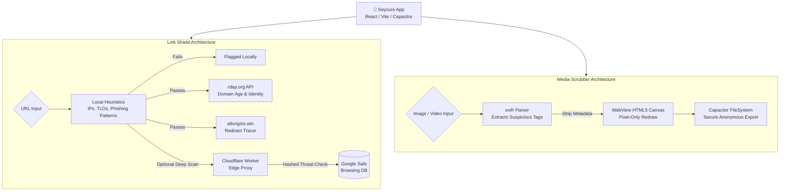

# 🛡️ Seycure by ArkQube

Seycure is a modern, privacy-first mobile application designed to protect users from two primary digital threats: **malicious links** and **hidden metadata in media files**. Built with complete on-device processing where possible, Seycure ensures your data never leaves your device without your explicit intent.

---

## 🎯 Motivation & Problem Statement
In today's digital landscape, users frequently share links and media without knowing the hidden risks:
1. **Shortened URLs** (e.g., bit.ly) obscure the true destination of a link, often masking phishing attempts or malware downloads.
2. **Media Files** (photos and videos) contain invisible EXIF metadata (exact GPS coordinates, device models, software versions) that can drastically compromise physical privacy when shared online.

**Seycure solves these issues by providing a dual-mode utility:**
* **Link Shield:** A sandboxed environment to unwrap, scan, and safely preview URLs before they are opened in a standard browser.
* **Media Scrubber:** A local, offline tool that reads, displays, and completely permanently strips all sensitive metadata from media before exporting or sharing.

---

## 🌟 Core Features in Detail

### 1. Link Shield (Threat Detection & Preview)
The Link Shield acts as a secure quarantine zone for URLs.

* **URL Unwrapping (Redirect Resolution):**
  * When a shortened URL is pasted, Seycure automatically detects it against a local blocklist of known URL shorteners.
  * It utilizes the `allorigins.win` CORS proxy to perform a `HEAD` request, gracefully following redirects without executing any JavaScript or downloading payloads.
  * The final, resolved URL destination is extracted from the `status.url` response and presented to the user.

* **Hybrid Threat Detection:**
  * **Local Heuristics:** Instantly flags suspicious Top-Level Domains (TLDs like `.zip`, `.tk`), IP-based domains (e.g., `http://192.168.1.1`), and known phishing keyword patterns right on the device.
  * **Google Safe Browsing API:** If the URL passes local checks, it is securely transmitted to a custom **Cloudflare Worker proxy**. This serverless worker holds your secret Google Safe Browsing API key, hashes the URL, queries Google's massive threat database (checking for Malware, Social Engineering, and Unwanted Software), and returns a definitive clean/flagged verdict to the app.

* **Redirect Chain Detector:**
  * When resolving links, the app natively traces the redirect hop path using a free public CORS proxy (`allorigins.win`).
  * The frontend displays a visual hop-by-hop map to help uncover nested tracking links (e.g., `bit.ly` -> `tracking.mailchimp.com` -> `final.com`).

* **Domain Trust Analyzer:**
  * Queries international domain registries directly from the device natively via the free, ICANN-mandated public `rdap.org` Bootstrap registry API.
  * No backend, secret key, or Cloudflare Worker is required.
  * **Cost & Sourcing Matrix:**
    * **Domain age:** `rdap.org` API (Free)
    * **HTTPS check:** On-device URL parsing (Free)
    * **Suspicious TLD:** On-device 20-TLD heuristic list (Free)
    * **Registrar name:** `rdap.org` API (Free)
    * **Expiry date:** `rdap.org` API (Free)
    * **Trust Score:** Computed locally from above signals (Free)
  * Extracts the precise **Domain Creation Date** and registry name to warn users if a domain is brand new (a common fingerprint of disposable phishing sites).
  * Displays a gorgeous 0-100 visual **Trust Score** calculated locally via HTTPS presence, TLD suspicion, and Domain Age.

* **Sandboxed WebView:**
  * Links are loaded within a specialized `iframe` preview environment. This sandbox is strictly locked down (e.g., `sandbox="allow-scripts allow-same-origin"`) to prevent malicious popups, automatic downloads, or cross-site scripting (XSS) attacks.

* **QR Code Scanner:**
  * Integrated directly via the `html5-qrcode` library.
  * Allows users to dynamically scan physical QR codes using their device camera.
  * Includes a **From Gallery** feature, allowing users to select an image from their device containing a QR code. The app decodes the image locally and extracts the hidden URL for scanning.

***

### 2. Media Scrubber (Metadata Removal)
The Media Scrubber protects physical location privacy without compromising image quality.

* **Deep EXIF Extraction:**
  * Uses the `exifr` parsing engine to delve deep into the file buffer of uploaded JPEGs, PNGs, and HEICs.
  * Extracts and visually warns users about specific tags: `GPSLatitude`, `GPSLongitude`, `Make`, `Model`, and `Software`.

* **100% On-Device Canvas Stripping:**
  * **No server uploads are ever performed.**
  * When a file is processed, it is drawn onto an invisible HTML5 `<canvas>` element natively within the WebView.
  * The canvas is instantly exported back out as a pristine `base64` data string (`canvas.toDataURL()`). Because the Canvas API only processes pixel data, **all underlying metadata is permanently destroyed** in the output.

* **Anonymous Export & Renaming:**
  * To prevent original filenames (which often contain timestamps like `IMG_20231024_153022.jpg`) from leaking information, the output file is completely anonymized.
  * Files are saved or exported as `ArkQube_[timestamp]_[random-hash].[extension]`.
  * Users can either share directly to other apps (WhatsApp, Telegram, etc.) using the native Android Share Sheet via `@capacitor/share`, or download the file straight to their Documents folder via `@capacitor/filesystem`.

---

## 🏗️ Technical Architecture & Tech Stack

Seycure utilizes a modern hybrid web-to-native architecture, combining the development speed of React with the native capabilities of Android via Capacitor. The application is designed to be predominantly **offline-first and zero-cost**, relying on native device APIs and public registries to perform complex tasks without expensive backend infrastructure.

### 🌐 Complete System Data Flow



### Frontend ⚛️
* **Framework:** React 18 + TypeScript
* **Bundler:** Vite (Lightning-fast HMR and optimized production Rollup builds)
* **Styling:** Tailwind CSS + custom Shadcn UI components for a premium, responsive look.
* **Icons:** Lucide React icons.
* **Libraries:**
  * `exifr`: Fast, robust EXIF parser.
  * `html5-qrcode`: Cross-browser QR code scanning library.

### Native Bridge (Android) 📱
* **Runtime:** Capacitor v6
* **Plugins:**
  * `@capacitor/share`: Bridges web share requests to the native Android `Intent.ACTION_SEND`.
  * `@capacitor/filesystem`: Provides access to native device storage (saving to `Directory.Documents`).
* **Android Configuration:**
  * Target SDK Version: **34** (Required for 2024 Play Store submissions)
  * Custom `styles.xml` to support Android 12+ API custom Animated Splash Screens.

### Backend (Optional Secure Proxy) ☁️
* **Platform:** Cloudflare Workers (Serverless)
* **Purpose:** The core app (RDAP checks, Metadata Scrubbing, URL unraveling) is 100% on-device and free. However, the app cannot securely store the Google Safe Browsing API key in the client bundle. If you wish to enable Google Safe Browsing, the Cloudflare Worker acts as a lightweight edge proxy. It accepts the URL from the app, appends the hidden API key on the server, makes the Google request, and forwards the response back to the app with proper CORS headers.

---

## 📁 Project Structure

```text
a:\DEV\clrlink\
├── app/                      # The main frontend application and native bridge
│   ├── android/              # Native Android Studio project (generated by Capacitor)
│   ├── public/               # Static assets (including the ArkQube logo)
│   ├── src/                  # React source code
│   │   ├── components/       # Reusable UI components (Modals, Dialogs, Cards)
│   │   ├── hooks/            # Custom React hooks (e.g., useNativeShare)
│   │   ├── lib/              # Utility functions (Tailwind merges, etc.)
│   │   ├── App.tsx           # Main application logic and routing
│   │   └── index.css         # Global Tailwind styles
│   ├── capacitor.config.ts   # Capacitor configuration (Splash Screen, App ID)
│   ├── package.json          # Frontend dependencies
│   └── vite.config.ts        # Vite bundler configuration
```

---

## 🚀 Setup & Development Guide

### 1. Prerequisites
* **Node.js** (v18 or newer)
* **Android Studio** (Ladybug or newer recommended)
* **Java JDK** (v17+)
* **Cloudflare Wrangler CLI** (`npm i -g wrangler`)

### 2. Running the Web App Locally
Navigate to the `app` directory, install dependencies, and start the Vite development server:
```bash
cd app
npm install
npm run dev
```

### 3. Optional: Cloudflare Worker Secure Proxy
**Note: The application functions completely free and natively without this.** However, if you wish to query the Google Safe Browsing API, you should deploy the `worker` directory proxy to hide your Google API key:
```bash
cd worker
npm install
npx wrangler deploy
# Set your Google Safe Browsing API key as a secure secret
npx wrangler secret put GOOGLE_SAFE_BROWSING_API_KEY
```

### 4. Building & Running on Android
Once the web app is ready, build it and sync it to the native Android environment:
```bash
cd app

# Build the production React bundle (outputs to /dist)
npm run build

# Sync the web bundle and Capacitor plugins to the Android project
npx cap sync android
```
After syncing, open the `app/android` directory in Android Studio:
1. Allow Gradle to finish syncing the project dependencies.
2. Select your physical device or emulator.
3. Press **Run** (▶️) to install and launch the APK.

### 5. Generating a Release Build (For Play Store)
To generate a signed App Bundle (AAB) for Google Play:
1. In Android Studio, go to **Build > Generate Signed Bundle / APK**.
2. Select **Android App Bundle**.
3. Create or select an existing Keystore and provide the passwords.
4. Select the **release** build variant.
5. Click **Finish**. (The output `.aab` file will be in `android/app/release/`).

---

## 🔒 Privacy & Permissions
Because Seycure processes highly sensitive links and media, the application operates strictly on-device wherever possible.
* **Camera (`android.permission.CAMERA`):** Requested only when activating the QR Code Scanner.
* **Storage (`android.permission.READ_MEDIA_IMAGES` / `READ_EXTERNAL_STORAGE`):** Requested only to select and parse media files for metadata scrubbing or QR code extraction.
* **Network Integration:** The completely free external network requests made are (1) to `allorigins.win` for resolving shortened URLs and tracking redirects, and (2) to the `rdap.org` Bootstrap registry for public domain WHOIS information. **No user media or browsing history is ever uploaded, logged, or stored off-device.**
